# Vector Databases, Semantic Search & RAG

> A comprehensive deep-dive into embeddings, vector databases, semantic search, and Retrieval Augmented Generation (RAG) for AI applications.

---

## Table of Contents

1. [Fundamentals: From Keywords to Vectors](#fundamentals-from-keywords-to-vectors)
2. [Vector Embeddings Deep Dive](#vector-embeddings-deep-dive)
3. [Vector Databases Architecture](#vector-databases-architecture)
4. [Semantic Search Explained](#semantic-search-explained)
5. [RAG (Retrieval Augmented Generation)](#rag-retrieval-augmented-generation)
6. [Real-World Use Cases](#real-world-use-cases)
7. [Implementation Patterns](#implementation-patterns)
8. [Advanced Concepts](#advanced-concepts)
9. [Performance & Optimization](#performance--optimization)
10. [Production Best Practices](#production-best-practices)

---

## Fundamentals: From Keywords to Vectors

### The Problem with Traditional Search

**Traditional Keyword Search:**
```
Query: "automobile"
Database: ["car", "vehicle", "truck", "bicycle"]
Result: No matches (exact string matching)
```

**The limitation:** Computers don't understand meaning, only exact characters.

### The Solution: Vector Embeddings

**Convert everything to numbers that capture meaning:**

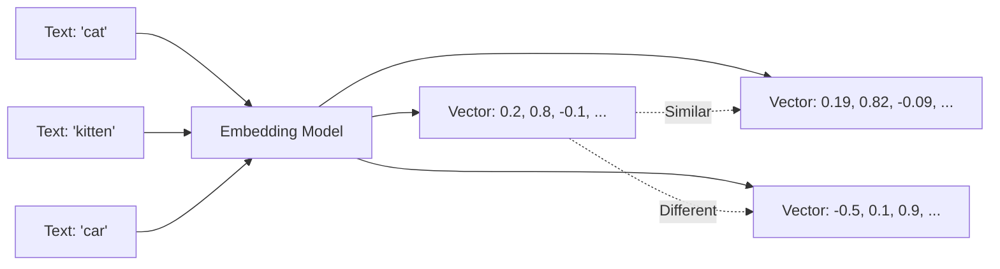

**Key insight:** Similar concepts have similar vectors (numerically close in high-dimensional space).

---

### Why This is Revolutionary

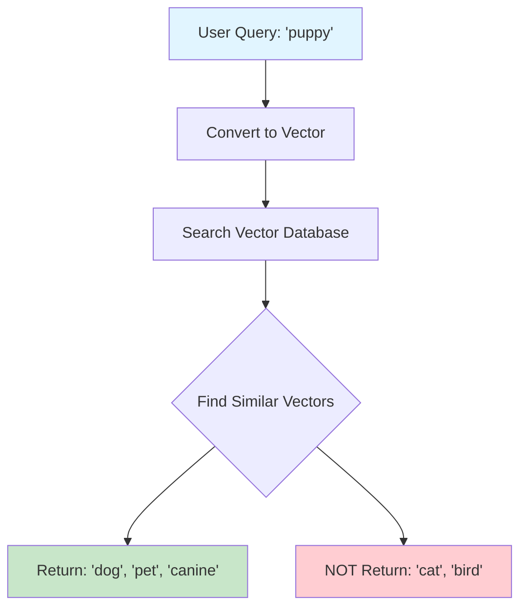

**Result:** Semantic understanding, not just keyword matching.

---

## Vector Embeddings Deep Dive

### What Are Embeddings?

**Definition:** Mathematical representations of data (text, images, audio) as arrays of numbers that capture semantic meaning.

**Visual Representation:**

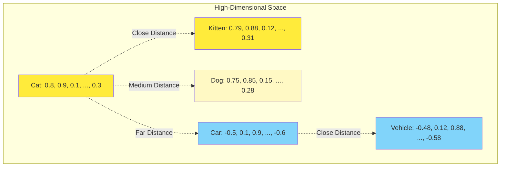

---

### How Embeddings Work

#### 1. Training Phase

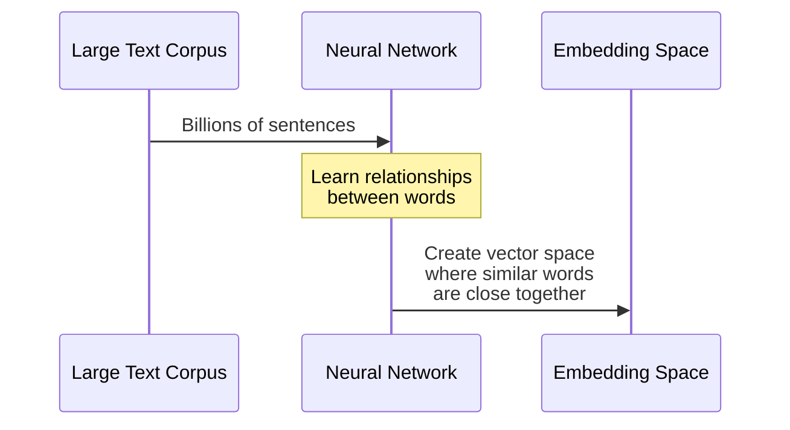

**What the model learns:**
- "king" - "man" + "woman" ≈ "queen"
- "Paris" - "France" + "Italy" ≈ "Rome"
- "swimming" ≈ "swim" + "ing"

---

#### 2. Vector Dimensions

**Typical dimensions:** 384, 768, 1536 numbers per embedding

```
Example: Sentence "I love cats"

Embedding (simplified to 5 dimensions):
[0.234, -0.891, 0.456, 0.123, -0.234]

In reality (1536 dimensions):
[0.234, -0.891, 0.456, ..., -0.234]  // 1536 numbers!
```

**Why many dimensions?**
- Capture complex relationships
- More nuance and context
- Better separation of different concepts

---

### Types of Embeddings

#### 1. Text Embeddings

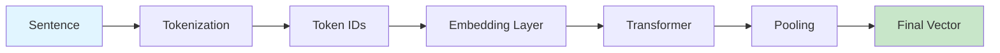

**Popular Models:**

| Model | Dimensions | Best For | Performance |
|-------|-----------|----------|-------------|
| **OpenAI Ada-002** | 1536 | General purpose | ⭐⭐⭐⭐⭐ |
| **all-MiniLM-L6-v2** | 384 | Fast, lightweight | ⭐⭐⭐⭐ |
| **all-mpnet-base-v2** | 768 | Quality/Speed balance | ⭐⭐⭐⭐⭐ |
| **E5-large** | 1024 | High accuracy | ⭐⭐⭐⭐⭐ |
| **BGE-large** | 1024 | Chinese + English | ⭐⭐⭐⭐⭐ |

---

#### 2. Image Embeddings

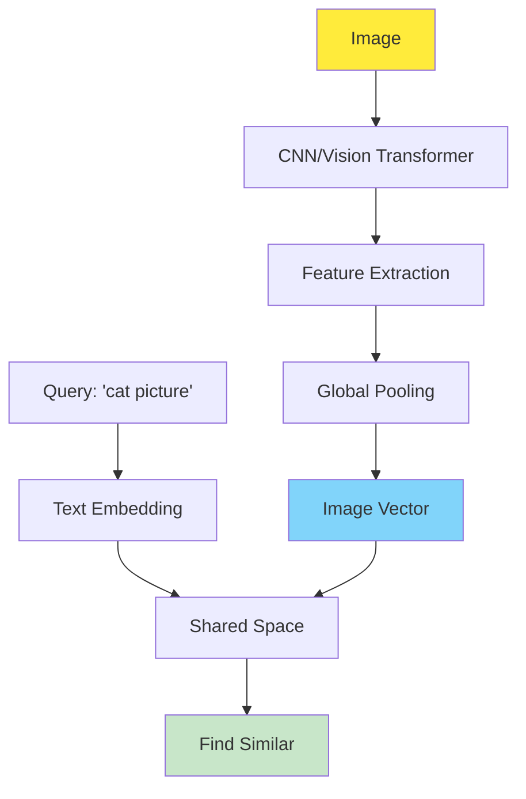

**Models:**
- **CLIP:** Text-to-image matching
- **ResNet50:** Image classification features
- **Vision Transformers:** State-of-the-art image understanding

**Use cases:**
- Reverse image search
- Similar product recommendations
- Content moderation

---

#### 3. Multimodal Embeddings

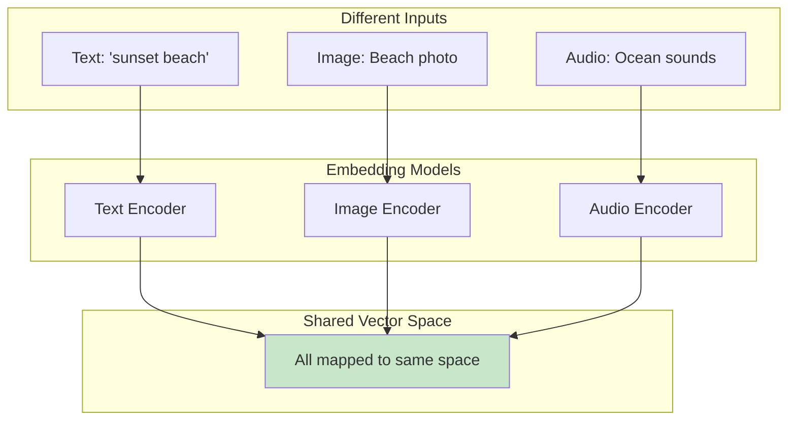

**Revolutionary capability:** Search images with text, find similar videos from audio, cross-modal retrieval.

---

### Distance Metrics: Measuring Similarity

#### 1. Cosine Similarity (Most Common)

**Formula:**
```
similarity = (A · B) / (||A|| × ||B||)
```

**Range:** -1 (opposite) to 1 (identical)

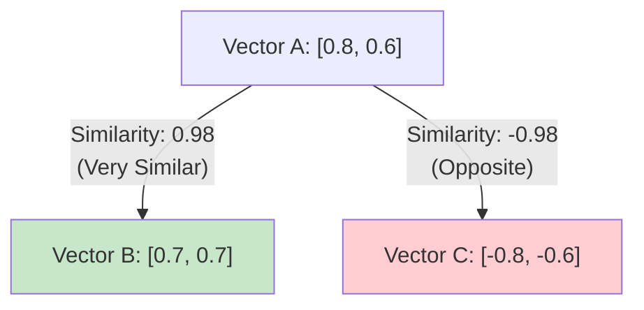

**Why cosine?**
- Direction matters more than magnitude
- Normalized (0 to 1 scale)
- Works well for text

---

#### 2. Euclidean Distance

**Formula:**
```
distance = sqrt((A₁-B₁)² + (A₂-B₂)² + ... + (Aₙ-Bₙ)²)
```

**Range:** 0 (identical) to ∞ (very different)

**When to use:** When magnitude matters (e.g., feature vectors with meaningful scales)

---

#### 3. Dot Product

**Formula:**
```
similarity = A₁×B₁ + A₂×B₂ + ... + Aₙ×Bₙ
```

**Fast but unnormalized** - good for pre-normalized vectors

---

### Embedding Quality

**What makes a good embedding?**

1. **Semantic Similarity**
   - Similar concepts → similar vectors
   - Dissimilar concepts → distant vectors

2. **Compositionality**
   - "New York" ≠ "New" + "York"
   - Handle multi-word expressions

3. **Context-Awareness**
   - "bank" (financial) vs "bank" (river)
   - Different vectors based on context

4. **Dimensionality**
   - Higher dimensions = more nuance
   - But: slower search, more storage

---

## Vector Databases Architecture

### Why Traditional Databases Don't Work

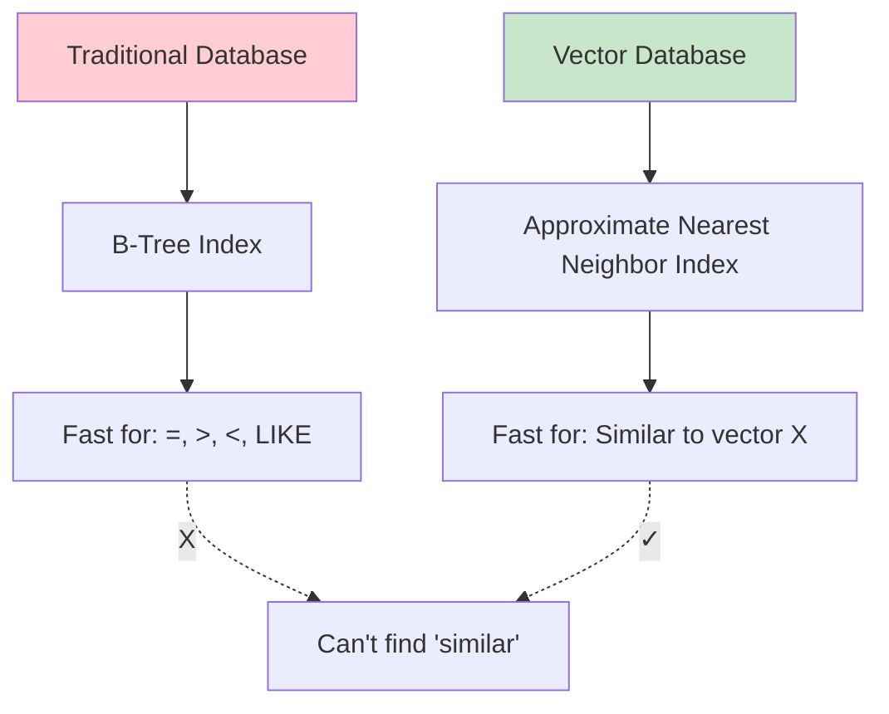

**Problem:** Traditional indexes (B-tree, hash) can't efficiently find "nearest neighbors" in high-dimensional space.

---

### Vector Database Components

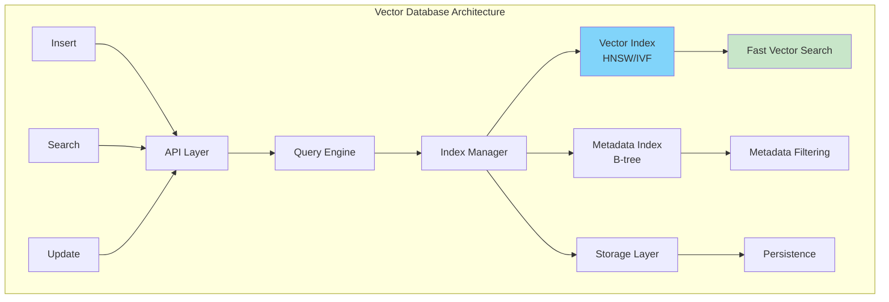

---

### Key Components Explained

#### 1. Vector Index (The Core)

**Purpose:** Find nearest neighbors efficiently

**Problem:** Brute force search
```python
# Check every vector - SLOW!
for vector in database:
    distance = calculate_distance(query, vector)
    
# Time complexity: O(n) - gets slower as database grows
```

**Solution:** Approximate Nearest Neighbor (ANN) algorithms

---

#### 2. ANN Algorithms

##### **HNSW (Hierarchical Navigable Small World)**

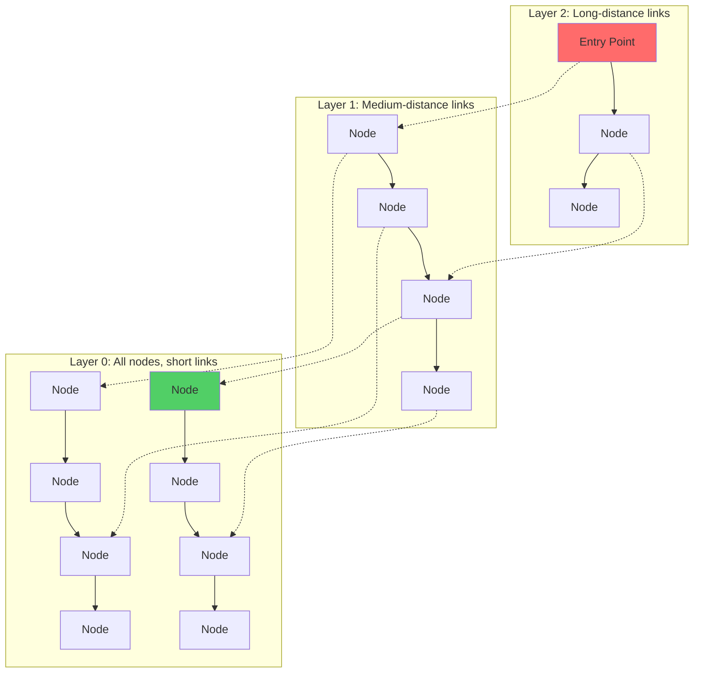

**How it works:**
1. Start at top layer (sparse, long jumps)
2. Navigate to nearest neighbor
3. Drop to lower layer (denser)
4. Repeat until bottom layer
5. Find k-nearest neighbors

**Performance:**
- **Search:** O(log n) - extremely fast!
- **Insert:** O(log n)
- **Memory:** Higher (stores graph structure)

**Best for:** High-performance production systems

---

##### **IVF (Inverted File Index)**

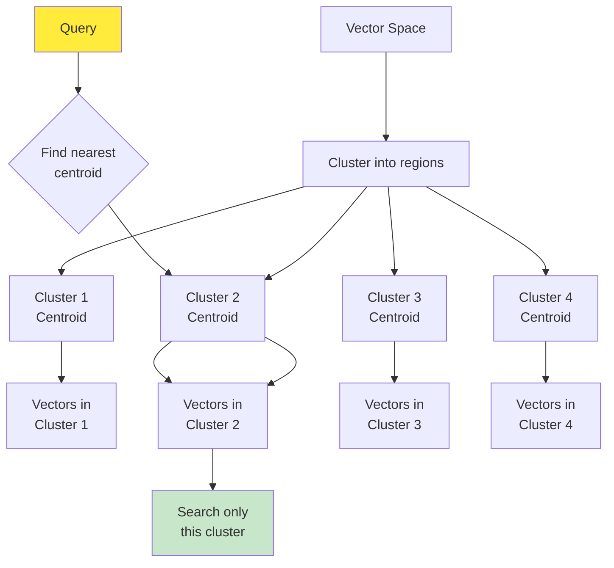

**How it works:**
1. Partition vectors into clusters (k-means)
2. Store cluster centroids
3. Query finds nearest centroid(s)
4. Search only those clusters

**Performance:**
- **Search:** O(√n) with good clustering
- **Memory:** Lower than HNSW
- **Accuracy:** Slightly lower (approximate)

**Best for:** Very large datasets where memory is constrained

---

##### **Product Quantization (PQ)**

**Concept:** Compress vectors to save memory

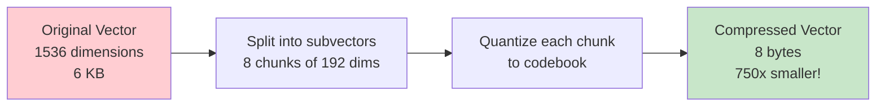

**Tradeoff:**
- 📉 Memory: 10-100x reduction
- 📉 Accuracy: Slight decrease (5-10%)
- 📈 Speed: Faster (less data to process)

**Best for:** Massive scale (billions of vectors)

---

### Popular Vector Databases

#### Comparison Matrix

| Database | Type | Best For | Scalability | Ease of Use |
|----------|------|----------|-------------|-------------|
| **Pinecone** | Managed | Production, serverless | ⭐⭐⭐⭐⭐ | ⭐⭐⭐⭐⭐ |
| **Weaviate** | Open Source | Flexibility, multimodal | ⭐⭐⭐⭐ | ⭐⭐⭐⭐ |
| **Milvus** | Open Source | High performance, scale | ⭐⭐⭐⭐⭐ | ⭐⭐⭐ |
| **Qdrant** | Open Source | Filtering, accuracy | ⭐⭐⭐⭐ | ⭐⭐⭐⭐ |
| **Chroma** | Embedded | Development, prototyping | ⭐⭐⭐ | ⭐⭐⭐⭐⭐ |
| **pgvector** | Extension | Existing PostgreSQL | ⭐⭐⭐ | ⭐⭐⭐⭐⭐ |

---

#### Detailed Comparison

##### **Pinecone** (Managed SaaS)

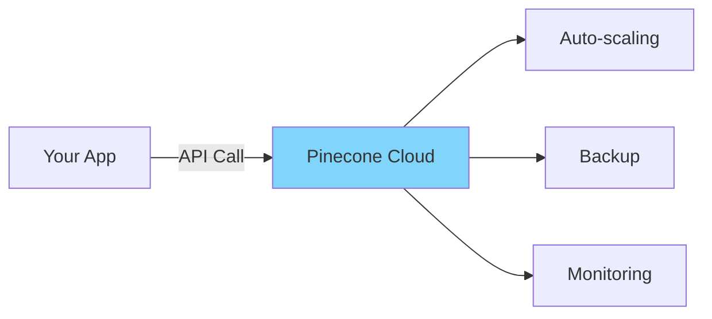

**Pros:**
- ✅ Zero infrastructure management
- ✅ Auto-scaling
- ✅ Built-in monitoring
- ✅ Multi-cloud support

**Cons:**
- ❌ Vendor lock-in
- ❌ Cost at scale
- ❌ Limited customization

**Best for:** Startups, rapid prototyping, don't want to manage infrastructure

---

##### **Weaviate** (Open Source)

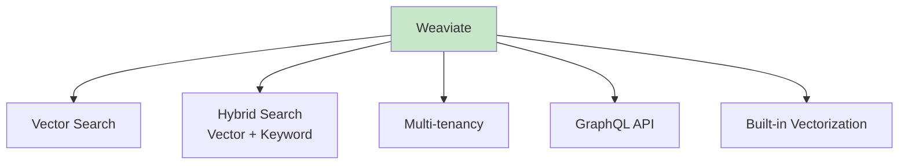

**Pros:**
- ✅ Open source (free)
- ✅ Hybrid search (vector + keywords)
- ✅ Multi-modal support
- ✅ GraphQL API
- ✅ Built-in ML models

**Cons:**
- ❌ Self-hosting required (managed version available)
- ❌ Complex configuration

**Best for:** Complex search needs, multi-modal data, hybrid search

---

##### **Milvus** (Open Source, High Performance)

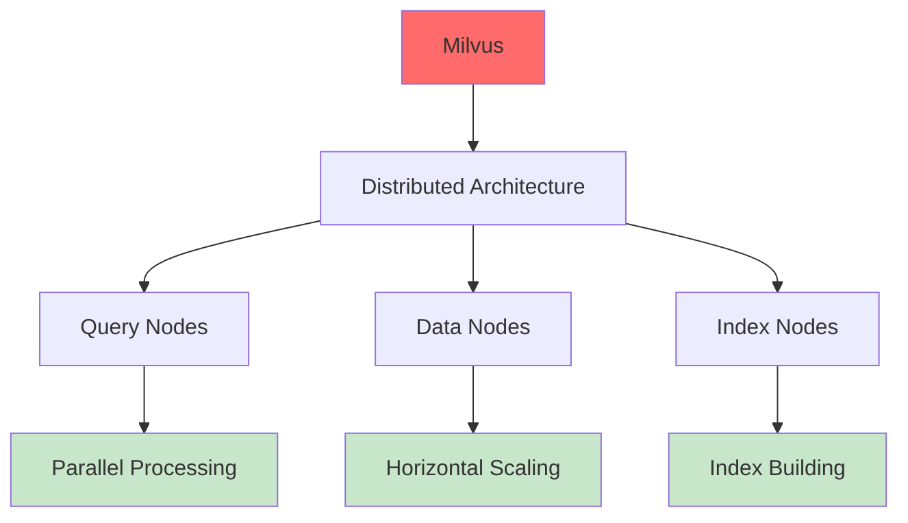

**Pros:**
- ✅ Highest performance at scale
- ✅ Distributed architecture
- ✅ Multiple index types
- ✅ GPU acceleration support

**Cons:**
- ❌ Complex setup
- ❌ Steeper learning curve
- ❌ Resource intensive

**Best for:** Large enterprises, billions of vectors, high throughput

---

##### **Chroma** (Embedded, Developer-Friendly)

```python
# Simplest to get started!
import chromadb

client = chromadb.Client()
collection = client.create_collection("docs")

collection.add(
    documents=["Python is great", "JavaScript is fun"],
    ids=["1", "2"]
)

results = collection.query(
    query_texts=["programming languages"],
    n_results=2
)
```

**Pros:**
- ✅ Embedded (no server needed)
- ✅ Simplest API
- ✅ Perfect for prototyping
- ✅ Automatic embedding

**Cons:**
- ❌ Not for production scale
- ❌ Limited features
- ❌ Single machine

**Best for:** Development, notebooks, small projects

---

##### **pgvector** (PostgreSQL Extension)

```sql
-- Use vector search in PostgreSQL!
CREATE TABLE documents (
  id SERIAL PRIMARY KEY,
  content TEXT,
  embedding vector(1536)
);

CREATE INDEX ON documents 
USING ivfflat (embedding vector_cosine_ops);

-- Find similar documents
SELECT content 
FROM documents 
ORDER BY embedding <-> '[0.1, 0.2, ...]'::vector 
LIMIT 5;
```

**Pros:**
- ✅ Use existing PostgreSQL knowledge
- ✅ ACID transactions
- ✅ Join with relational data
- ✅ Mature ecosystem

**Cons:**
- ❌ Not as fast as specialized DBs
- ❌ Limited to ~100M vectors
- ❌ No built-in clustering

**Best for:** Adding vector search to existing PostgreSQL apps

---

### Vector Database Operations

#### 1. Insert Operation

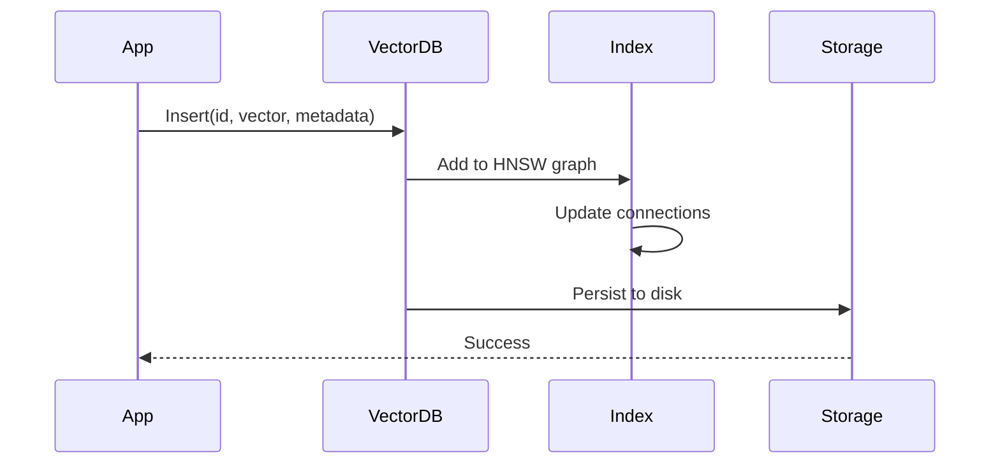

**Code Example (Pinecone):**
```python
import pinecone

index = pinecone.Index("my-index")

# Insert vectors
index.upsert(vectors=[
    {
        "id": "doc1",
        "values": [0.1, 0.2, ..., 0.5],  # 1536 dimensions
        "metadata": {
            "title": "Introduction to AI",
            "category": "education",
            "date": "2024-01-15"
        }
    }
])
```

---

#### 2. Search Operation

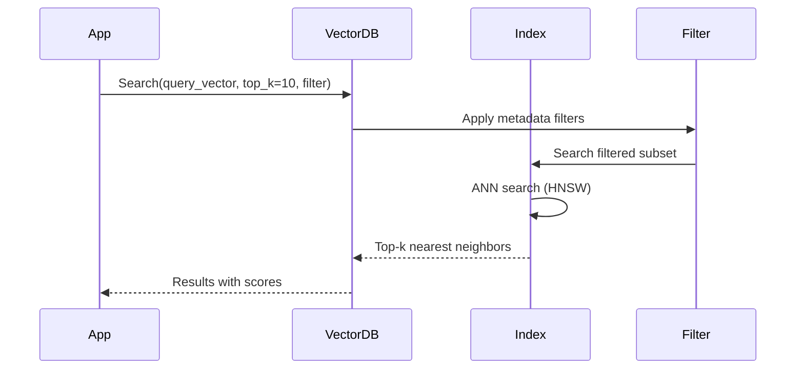

**Code Example:**
```python
# Search with filters
results = index.query(
    vector=[0.1, 0.2, ..., 0.5],
    top_k=10,
    filter={
        "category": {"$eq": "education"},
        "date": {"$gte": "2024-01-01"}
    },
    include_metadata=True
)

for match in results.matches:
    print(f"ID: {match.id}")
    print(f"Score: {match.score}")
    print(f"Title: {match.metadata['title']}")
```

---

#### 3. Update Operation

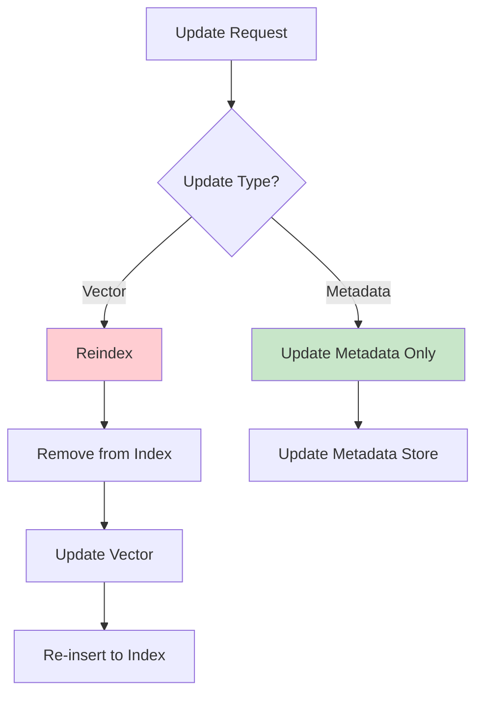

**Important:** Updating vectors is expensive (requires re-indexing). Updating metadata is cheap.

---

#### 4. Delete Operation

```python
# Delete by ID
index.delete(ids=["doc1", "doc2"])

# Delete by filter (Pinecone)
index.delete(filter={"category": "outdated"})
```

---

### Metadata Filtering

**Crucial for real-world applications!**

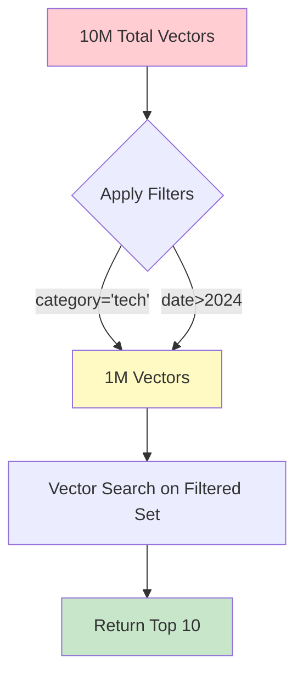

**Example filters:**
```python
filter = {
    # Equality
    "category": {"$eq": "tech"},
    
    # Comparison
    "price": {"$gte": 10, "$lte": 100},
    
    # Array contains
    "tags": {"$in": ["python", "ai"]},
    
    # Logical operators
    "$and": [
        {"category": "tech"},
        {"date": {"$gte": "2024-01-01"}}
    ]
}
```

**Performance tip:** Create secondary indexes on frequently filtered fields!

---

## Semantic Search Explained

### Traditional Search vs Semantic Search

```mermaid
graph TD
    subgraph "Traditional Keyword Search"
        A1[Query: 'automobile'] --> B1[Exact Match]
        B1 --> C1[Results: 'automobile']
        B1 -.X.-> D1[Misses: 'car', 'vehicle']
    end
    
    subgraph "Semantic Search"
        A2[Query: 'automobile'] --> B2[Embedding]
        B2 --> C2[Vector: 0.5, 0.8, ...]
        C2 --> D2[Find Similar Vectors]
        D2 --> E2[Results: 'car', 'vehicle',<br/>'automobile', 'sedan']
    end
    
    style C1 fill:#ffcdd2
    style E2 fill:#c8e6c9
```

---

### How Semantic Search Works

```mermaid
sequenceDiagram
    participant User
    participant App
    participant EmbedModel as Embedding Model
    participant VectorDB as Vector Database
    
    Note over User,VectorDB: Indexing Phase (One-time)
    App->>EmbedModel: Embed documents
    EmbedModel-->>App: Document vectors
    App->>VectorDB: Store vectors + metadata
    
    Note over User,VectorDB: Search Phase (Every query)
    User->>App: Query: "best restaurants"
    App->>EmbedModel: Embed query
    EmbedModel-->>App: Query vector
    App->>VectorDB: Find similar vectors
    VectorDB-->>App: Top-k results
    App-->>User: Display results
```

---

### Semantic Search Architecture

```mermaid
graph TD
    subgraph "Document Processing Pipeline"
        A[Raw Documents] --> B[Chunking]
        B --> C[Embedding Model]
        C --> D[Vector Database]
    end
    
    subgraph "Search Pipeline"
        E[User Query] --> F[Embedding Model]
        F --> G[Vector Search]
        G --> H[Retrieve Documents]
        H --> I[Rank & Filter]
        I --> J[Return Results]
    end
    
    D -.Store.-> G
    
    style A fill:#ffeb3b
    style E fill:#ffeb3b
    style J fill:#c8e6c9
```

---

### Advanced Semantic Search Techniques

#### 1. Hybrid Search (Best of Both Worlds)

```mermaid
graph TD
    A[User Query] --> B[Keyword Search]
    A --> C[Semantic Search]
    
    B --> D[BM25 Scores]
    C --> E[Cosine Similarity Scores]
    
    D --> F[Score Fusion]
    E --> F
    F --> G[Re-ranked Results]
    
    style F fill:#81d4fa
    style G fill:#c8e6c9
```

**Formula (RRF - Reciprocal Rank Fusion):**
```
Combined_Score = α × Keyword_Score + (1-α) × Semantic_Score

Where α = 0.5 typically (equal weight)
```

**Why hybrid?**
- Keyword search: Good for exact matches (names, codes, IDs)
- Semantic search: Good for concepts and meaning
- Combined: Best accuracy!

**Example:**
```python
# Weaviate hybrid search
results = collection.query.hybrid(
    query="python programming",
    alpha=0.5,  # 50% keyword, 50% semantic
    limit=10
)
```

---

#### 2. Reranking

```mermaid
sequenceDiagram
    participant VectorDB
    participant Reranker
    participant User
    
    VectorDB->>Reranker: Top 100 candidates
    Note over Reranker: Cross-encoder model<br/>scores query-doc pairs
    Reranker->>Reranker: Expensive but accurate scoring
    Reranker-->>User: Top 10 best results
```

**Two-stage retrieval:**

1. **Stage 1:** Fast vector search (retrieve 100 candidates)
2. **Stage 2:** Accurate reranking (score each with cross-encoder)

**Performance:**
- Vector search: ~10ms
- Reranking: ~100ms
- Total: ~110ms (still fast!)

**Code Example:**
```python
from sentence_transformers import CrossEncoder

# Stage 1: Vector search
candidates = vector_db.search(query_embedding, top_k=100)

# Stage 2: Rerank
reranker = CrossEncoder('cross-encoder/ms-marco-MiniLM-L-6-v2')
scores = reranker.predict([
    (query, doc.text) for doc in candidates
])

# Get top 10 after reranking
top_results = sorted(
    zip(candidates, scores), 
    key=lambda x: x[1], 
    reverse=True
)[:10]
```

---

#### 3. Query Expansion

**Problem:** User queries are often too short

```mermaid
graph LR
    A[Original Query:<br/>'AI'] --> B[Query Expansion]
    B --> C['AI', 'artificial intelligence',<br/>'machine learning',<br/>'deep learning', 'neural networks']
    C --> D[Search with<br/>all terms]
    D --> E[Better Results]
    
    style A fill:#ffcdd2
    style C fill:#81d4fa
    style E fill:#c8e6c9
```

**Techniques:**
- Synonym expansion
- LLM-based query rewriting
- Pseudo-relevance feedback

**Example with LLM:**
```python
prompt = f"""
Expand this search query with related terms:
Query: {user_query}

Provide 5 related search terms:
"""

expanded_terms = llm.generate(prompt)

# Search with all expanded terms
results = []
for term in expanded_terms:
    results.extend(semantic_search(term))
```

---

## RAG (Retrieval Augmented Generation)

### What is RAG?

**Problem LLMs have:**
- Knowledge cutoff (outdated information)
- No access to private/company data
- Hallucination (make up facts)
- Can't cite sources

**RAG Solution:**
1. Retrieve relevant documents from your data
2. Augment the LLM prompt with this context
3. Generate answer based on your data

---

### RAG Architecture

```mermaid
graph TD
    subgraph "Knowledge Base"
        A[Documents] --> B[Chunking]
        B --> C[Embedding]
        C --> D[Vector Database]
    end
    
    subgraph "RAG Pipeline"
        E[User Question] --> F[Embed Question]
        F --> G[Semantic Search]
        G --> D
        D --> H[Retrieved Docs]
        H --> I[Construct Prompt]
        E --> I
        I --> J[LLM]
        J --> K[Generated Answer]
    end
    
    style E fill:#ffeb3b
    style K fill:#c8e6c9
```

---

### RAG Step-by-Step

#### Step 1: Document Ingestion

```mermaid
sequenceDiagram
    participant Docs as Documents
    participant Chunker
    participant Embedder as Embedding Model
    participant VectorDB
    
    Docs->>Chunker: Load documents
    Note over Chunker: Split into chunks<br/>512-1024 tokens
    Chunker->>Embedder: Process chunks
    Embedder->>VectorDB: Store vectors + metadata
```

**Code Example:**
```python
from langchain.text_splitter import RecursiveCharacterTextSplitter
from langchain.embeddings import OpenAIEmbeddings
from langchain.vectorstores import Pinecone

# 1. Load documents
documents = load_documents("./data")

# 2. Split into chunks
text_splitter = RecursiveCharacterTextSplitter(
    chunk_size=1000,
    chunk_overlap=200,  # Overlap for context
    separators=["\n\n", "\n", " ", ""]
)
chunks = text_splitter.split_documents(documents)

# 3. Create embeddings and store
embeddings = OpenAIEmbeddings()
vectorstore = Pinecone.from_documents(
    chunks, 
    embeddings, 
    index_name="my-docs"
)
```

---

#### Step 2: Retrieval

```mermaid
graph LR
    A[User Question:<br/>'What is RAG?'] --> B[Embed Question]
    B --> C[Vector: 0.2, 0.5, ...]
    C --> D[Search Vector DB]
    D --> E[Top-k Relevant Chunks]
    E --> F[Chunk 1: RAG stands for...<br/>Chunk 2: RAG improves...<br/>Chunk 3: RAG uses vector...]
    
    style A fill:#ffeb3b
    style F fill:#c8e6c9
```

**Code Example:**
```python
# Retrieve relevant documents
question = "What is RAG?"
relevant_docs = vectorstore.similarity_search(
    question, 
    k=3  # Top 3 most relevant chunks
)

for doc in relevant_docs:
    print(f"Content: {doc.page_content}")
    print(f"Source: {doc.metadata['source']}")
    print(f"Score: {doc.metadata['score']}")
```

---

#### Step 3: Augmentation (Prompt Construction)

```mermaid
graph TD
    A[System Prompt] --> D[Final Prompt]
    B[Retrieved Context] --> D
    C[User Question] --> D
    D --> E[Send to LLM]
    
    style D fill:#81d4fa
```

**Prompt Template:**
```python
prompt_template = """
You are a helpful AI assistant. Answer the question based ONLY on the following context.
If the answer is not in the context, say "I don't have enough information to answer that."

Context:
{context}

Question: {question}

Answer:
"""

# Construct prompt
context = "\n\n".join([doc.page_content for doc in relevant_docs])
prompt = prompt_template.format(
    context=context,
    question=question
)
```

---

#### Step 4: Generation

```python
from openai import OpenAI

client = OpenAI()

response = client.chat.completions.create(
    model="gpt-4",
    messages=[
        {"role": "system", "content": "You are a helpful assistant."},
        {"role": "user", "content": prompt}
    ],
    temperature=0.7
)

answer = response.choices[0].message.content
print(answer)
```

---

### Complete RAG Implementation

```python
from langchain.chains import RetrievalQA
from langchain.llms import OpenAI
from langchain.vectorstores import Pinecone
from langchain.embeddings import OpenAIEmbeddings

# Setup
embeddings = OpenAIEmbeddings()
vectorstore = Pinecone.from_existing_index("my-docs", embeddings)
llm = OpenAI(temperature=0)

# Create RAG chain
qa_chain = RetrievalQA.from_chain_type(
    llm=llm,
    chain_type="stuff",  # Put all docs in prompt
    retriever=vectorstore.as_retriever(
        search_kwargs={"k": 3}
    ),
    return_source_documents=True
)

# Use it!
result = qa_chain({"query": "What is RAG?"})

print("Answer:", result['result'])
print("\nSources:")
for doc in result['source_documents']:
    print(f"- {doc.metadata['source']}")
```

---

### Advanced RAG Patterns

#### 1. Multi-Query RAG

```mermaid
graph TD
    A[User Question] --> B[LLM: Generate<br/>multiple queries]
    B --> C1[Query 1]
    B --> C2[Query 2]
    B --> C3[Query 3]
    
    C1 --> D[Retrieve Docs]
    C2 --> D
    C3 --> D
    
    D --> E[Merge & Deduplicate]
    E --> F[Generate Answer]
    
    style E fill:#81d4fa
```

**Why?** User questions are often imprecise. Multiple queries capture different aspects.

**Example:**
```python
from langchain.retrievers.multi_query import MultiQueryRetriever

retriever = MultiQueryRetriever.from_llm(
    retriever=vectorstore.as_retriever(),
    llm=llm
)

# Automatically generates multiple queries
docs = retriever.get_relevant_documents(
    "What are the benefits of using vectors?"
)
# Generated queries might be:
# 1. "Advantages of vector embeddings"
# 2. "Why use vector representations"
# 3. "Vector database use cases"
```

---

#### 2. Parent-Child Chunking

```mermaid
graph TD
    A[Original Document] --> B[Split into<br/>Parent Chunks<br/>2000 tokens]
    B --> C1[Parent 1]
    B --> C2[Parent 2]
    
    C1 --> D1[Child 1.1<br/>500 tokens]
    C1 --> D2[Child 1.2<br/>500 tokens]
    
    C2 --> D3[Child 2.1<br/>500 tokens]
    C2 --> D4[Child 2.2<br/>500 tokens]
    
    E[Search] --> D1
    D1 -.Retrieve.-> C1
    
    style D1 fill:#81d4fa
    style C1 fill:#c8e6c9
```

**Strategy:**
1. Index small chunks (better semantic matching)
2. Return large parent chunks (more context)

**Benefits:**
- Better search precision
- More complete context for LLM

---

#### 3. Hypothetical Document Embeddings (HyDE)

```mermaid
sequenceDiagram
    participant User
    participant LLM
    participant VectorDB
    
    User->>LLM: Question
    LLM->>LLM: Generate hypothetical<br/>answer (hallucinate!)
    LLM->>VectorDB: Embed hypothetical answer
    VectorDB-->>User: Find similar real docs
```

**Counterintuitive:** Use hallucination to improve search!

**Why it works:** Hypothetical answer is semantically similar to real answers.

**Example:**
```python
# 1. Generate hypothetical document
question = "What is machine learning?"
hyde_prompt = f"Write a detailed answer to: {question}"
hypothetical_doc = llm.generate(hyde_prompt)

# 2. Use hypothetical doc for search
results = vectorstore.similarity_search(hypothetical_doc)
```

---

#### 4. Agentic RAG

```mermaid
graph TD
    A[User Question] --> B{Agent Decision}
    B -->|Needs Context| C[Retrieve from VectorDB]
    B -->|Needs Calculation| D[Use Calculator Tool]
    B -->|Needs Current Data| E[Use Web Search]
    
    C --> F[Synthesize Answer]
    D --> F
    E --> F
    
    F --> G{Good Answer?}
    G -->|No| B
    G -->|Yes| H[Return to User]
    
    style B fill:#81d4fa
    style F fill:#ff6b6b
    style H fill:#c8e6c9
```

**Agent can:**
- Decide when to retrieve
- Query multiple sources
- Use tools (calculator, API calls)
- Self-correct

---

### RAG Evaluation

**Key metrics:**

```mermaid
graph TD
    A[RAG Evaluation] --> B[Retrieval Quality]
    A --> C[Generation Quality]
    
    B --> D["Precision@k"]
    B --> E["Recall@k"]
    B --> F["MRR - Mean Reciprocal Rank"]
    
    C --> G["Faithfulness<br/>Answer grounded in context?"]
    C --> H["Relevance<br/>Answer addresses question?"]
    C --> I["Coherence<br/>Answer is clear?"]
    
    style A fill:#81d4fa
```

---

#### Retrieval Metrics

**Precision@k:**
```
Precision@3 = (Relevant docs in top 3) / 3
```

**Recall@k:**
```
Recall@3 = (Relevant docs in top 3) / (Total relevant docs)
```

**MRR (Mean Reciprocal Rank):**
```
MRR = 1 / (Rank of first relevant document)

Example: First relevant doc at position 2 → MRR = 1/2 = 0.5
```

---

#### Generation Metrics

**Faithfulness:**
```python
# Are all statements in answer supported by context?
def check_faithfulness(answer, context):
    # Use LLM to verify each claim
    prompt = f"""
    Context: {context}
    Answer: {answer}
    
    Are all claims in the answer supported by the context?
    Answer Yes or No, then explain.
    """
    return llm.generate(prompt)
```

**Relevance:**
```python
# Does answer address the question?
def check_relevance(question, answer):
    prompt = f"""
    Question: {question}
    Answer: {answer}
    
    Does the answer directly address the question?
    Rate 1-5.
    """
    return llm.generate(prompt)
```

---

### RAG Challenges & Solutions

#### Challenge 1: Chunking Strategy

**Problem:** How to split documents?

```mermaid
graph TD
    A[Chunking Strategies] --> B[Fixed Size<br/>512 tokens]
    A --> C[Semantic Chunking<br/>Split by topic]
    A --> D[Recursive Splitting<br/>Try paragraphs, then sentences]
    
    B --> E[Pros: Simple<br/>Cons: May split mid-concept]
    C --> F[Pros: Coherent chunks<br/>Cons: Expensive, variable size]
    D --> G[Pros: Balance<br/>Cons: More complex]
    
    style C fill:#c8e6c9
```

**Best practice:** Recursive splitting with overlap
```python
splitter = RecursiveCharacterTextSplitter(
    chunk_size=1000,
    chunk_overlap=200,  # 20% overlap for context
    separators=["\n\n", "\n", ". ", " ", ""]
)
```

---

#### Challenge 2: Retrieved Context is Wrong

**Solutions:**

```mermaid
graph TD
    A[Improve Retrieval] --> B[Hybrid Search<br/>Keyword + Semantic]
    A --> C[Reranking<br/>Cross-encoder]
    A --> D[Query Expansion<br/>Multiple queries]
    A --> E[Better Embeddings<br/>Fine-tuned models]
    A --> F[Metadata Filtering<br/>Narrow search space]
```

---

#### Challenge 3: Hallucination Despite Context

**Solutions:**

1. **Explicit Grounding Instruction:**
```python
prompt = """
IMPORTANT: Answer ONLY using information from the context below.
If you cannot find the answer in the context, say "I don't have enough information."
DO NOT use your general knowledge.

Context: {context}
Question: {question}
"""
```

2. **Citation Requirement:**
```python
prompt = """
Answer the question and cite your sources using [1], [2], etc.

Context:
[1] RAG stands for Retrieval Augmented Generation...
[2] RAG improves LLM accuracy by...

Question: {question}

Answer with citations:
"""
```

3. **Fact Checking:**
```python
# Post-process answer to verify claims
def verify_answer(answer, context):
    claims = extract_claims(answer)
    for claim in claims:
        if not verify_in_context(claim, context):
            flag_hallucination(claim)
```

---

## Real-World Use Cases

### 1. Enterprise Knowledge Base (RAG)

```mermaid
graph TD
    A[Company Documents] --> B[Confluence, Google Docs,<br/>PDFs, Slack]
    B --> C[Ingestion Pipeline]
    C --> D[Vector Database]
    
    E[Employee Question] --> F[Search]
    F --> D
    D --> G[RAG System]
    G --> H[Answer with Sources]
    
    I[Benefits] --> J[Reduce support tickets<br/>24/7 availability<br/>Consistent answers]
    
    style H fill:#c8e6c9
    style J fill:#c8e6c9
```

**Example Questions:**
- "What's our vacation policy?"
- "How do I submit expenses?"
- "What are the engineering best practices?"

**ROI:**
- 70% reduction in internal support tickets
- Employees find answers in seconds vs. hours
- Onboarding time reduced by 50%

---

### 2. Customer Support Chatbot

```mermaid
sequenceDiagram
    participant Customer
    participant Chatbot
    participant VectorDB as Knowledge Base
    participant LLM
    participant Human as Human Agent
    
    Customer->>Chatbot: "How do I reset my password?"
    Chatbot->>VectorDB: Search KB
    VectorDB-->>Chatbot: Relevant articles
    Chatbot->>LLM: Generate answer
    LLM-->>Chatbot: Answer with steps
    Chatbot-->>Customer: "Here's how to reset..."
    
    alt Complex issue
        Customer->>Chatbot: "My account is locked"
        Chatbot->>Human: Escalate to human
        Human-->>Customer: Personalized help
    end
```

**Features:**
- Instant answers to common questions
- 24/7 availability
- Multilingual support
- Escalation to human when needed

**Metrics:**
- 60% of questions resolved by bot
- 3-second average response time
- 85% customer satisfaction

---

### 3. E-commerce Product Search

```mermaid
graph TD
    A[User: 'comfortable<br/>running shoes'] --> B[Semantic Search]
    B --> C[Vector Database<br/>Product Embeddings]
    C --> D[Relevant Products]
    
    E[Filters] --> F[Price, Brand,<br/>Size, Color]
    F --> D
    
    D --> G[Ranked Results]
    G --> H[User sees:<br/>Running shoes,<br/>Sneakers,<br/>Athletic footwear]
    
    style H fill:#c8e6c9
```

**Advanced features:**
- **Visual search:** Upload image → find similar products
- **Cross-modal:** Text query → image results
- **Personalization:** User history → personalized ranking

**Business impact:**
- 35% increase in click-through rate
- 20% increase in conversion
- Better discovery of long-tail products

---

### 4. Legal Document Analysis

```mermaid
graph TD
    A[Legal Corpus<br/>Millions of cases] --> B[Process & Embed]
    B --> C[Vector Database]
    
    D[Lawyer Query:<br/>'Precedents for<br/>patent infringement'] --> E[Semantic Search]
    E --> C
    C --> F[Relevant Cases]
    F --> G[RAG Analysis]
    G --> H[Summary + Citations]
    
    style H fill:#c8e6c9
```

**Capabilities:**
- Find similar cases across jurisdictions
- Identify relevant precedents
- Summarize key arguments
- Track legal changes over time

**Value:**
- 80% time savings in legal research
- More comprehensive case discovery
- Reduced risk of missing relevant precedents

---

### 5. Medical Literature Search

```mermaid
graph TD
    A[PubMed Articles<br/>30M+ papers] --> B[Embed Abstracts]
    B --> C[Vector Database]
    
    D[Researcher Query] --> E[Semantic Search]
    E --> C
    C --> F[Relevant Papers]
    
    G[Advanced Features] --> H[Citation Network<br/>Similar Studies<br/>Trend Analysis]
    
    style F fill:#c8e6c9
```

**Use cases:**
- Literature review
- Drug discovery research
- Clinical decision support
- Systematic reviews

**Impact:**
- 10x faster literature review
- Discover cross-disciplinary connections
- Stay current with latest research

---

### 6. Code Search (GitHub Copilot style)

```mermaid
graph LR
    A[Codebase] --> B[Parse & Embed<br/>Functions, Classes]
    B --> C[Vector Database]
    
    D[Developer:<br/>'parse JSON'] --> E[Semantic Search]
    E --> C
    C --> F[Similar Code]
    F --> G[Show Examples<br/>with Context]
    
    style G fill:#c8e6c9
```

**Features:**
- Natural language → code search
- Find similar implementations
- Cross-language search
- Usage examples

**Developer productivity:**
- 40% faster at finding relevant code
- Learn from existing patterns
- Reduce duplicate code

---

### 7. Content Recommendation

```mermaid
graph TD
    A[User Behavior] --> B[User Embedding]
    C[Content Library] --> D[Content Embeddings]
    
    B --> E[Find Similar<br/>Content]
    D --> E
    
    E --> F[Personalized<br/>Recommendations]
    
    G[Netflix Example] --> H[Watch History → Vector<br/>Movie Database → Vector<br/>Find Similar → Recommend]
    
    style F fill:#c8e6c9
```

**Applications:**
- Netflix/Spotify recommendations
- YouTube suggested videos
- News article recommendations
- E-learning course suggestions

**Why vectors?**
- Capture complex preferences
- Real-time updates
- Cold start problem (new users/items)
- Explain recommendations (similar to X)

---

### 8. Fraud Detection

```mermaid
graph TD
    A[Transaction Data] --> B[Create Transaction<br/>Embeddings]
    B --> C[Vector Space]
    
    D[New Transaction] --> E[Embed]
    E --> F[Find Nearest<br/>Neighbors]
    
    F --> G{Similar to<br/>Fraud Patterns?}
    G -->|Yes| H[Flag for Review]
    G -->|No| I[Approve]
    
    style H fill:#ffcdd2
    style I fill:#c8e6c9
```

**Features in embedding:**
- Transaction amount
- Time of day
- Merchant category
- User location
- Device fingerprint
- Historical patterns

**Benefits:**
- Real-time detection (<10ms)
- Detect new fraud patterns
- Reduce false positives
- Adapt to evolving threats

---

### 9. Anomaly Detection

```mermaid
graph TD
    A[Normal Behavior<br/>Vector Space] --> B[Cluster of<br/>Normal Patterns]
    
    C[New Data Point] --> D[Embed]
    D --> E{Distance to<br/>Normal Cluster}
    
    E -->|Close| F[Normal]
    E -->|Far| G[Anomaly!]
    
    style G fill:#ffcdd2
    style F fill:#c8e6c9
```

**Applications:**
- Network intrusion detection
- Manufacturing defect detection
- System performance monitoring
- Healthcare vital signs monitoring

**Example: Server Monitoring**
```python
# Normal server metrics embedded
normal_embeddings = [
    [0.1, 0.2, 0.3],  # Low CPU, normal memory
    [0.15, 0.25, 0.28],
    [0.12, 0.22, 0.31]
]

# New metric
new_metric = [0.9, 0.8, 0.85]  # High CPU, high memory
distance = cosine_distance(new_metric, normal_embeddings)

if distance > THRESHOLD:
    alert("Anomaly detected!")
```

---

### 10. Duplicate Detection

```mermaid
graph TD
    A[New Content] --> B[Embed]
    B --> C[Search Similar]
    C --> D{Distance < Threshold?}
    
    D -->|Yes| E[Potential Duplicate]
    D -->|No| F[Unique Content]
    
    E --> G[Merge or Flag]
    F --> H[Add to Database]
    
    style E fill:#fff9c4
    style F fill:#c8e6c9
```

**Use cases:**
- **E-commerce:** Detect duplicate product listings
- **Social media:** Find duplicate posts/spam
- **Help desk:** Merge duplicate tickets
- **News:** Identify same story from different sources

**Advantages over exact matching:**
- Catch paraphrased duplicates
- Different wording, same meaning
- Multilingual duplicates
- Near-duplicates (slightly modified)

---

## Implementation Patterns

### Pattern 1: Basic RAG

```python
"""
Simple RAG implementation
Use when: Small document set, straightforward Q&A
"""

from langchain.document_loaders import DirectoryLoader
from langchain.text_splitter import RecursiveCharacterTextSplitter
from langchain.embeddings import OpenAIEmbeddings
from langchain.vectorstores import Chroma
from langchain.chains import RetrievalQA
from langchain.llms import OpenAI

class SimpleRAG:
    def __init__(self, docs_path: str):
        # 1. Load documents
        loader = DirectoryLoader(docs_path)
        documents = loader.load()
        
        # 2. Split into chunks
        text_splitter = RecursiveCharacterTextSplitter(
            chunk_size=1000,
            chunk_overlap=200
        )
        chunks = text_splitter.split_documents(documents)
        
        # 3. Create embeddings and store
        embeddings = OpenAIEmbeddings()
        self.vectorstore = Chroma.from_documents(
            chunks, 
            embeddings
        )
        
        # 4. Create QA chain
        self.qa_chain = RetrievalQA.from_chain_type(
            llm=OpenAI(temperature=0),
            retriever=self.vectorstore.as_retriever()
        )
    
    def ask(self, question: str) -> str:
        """Ask a question and get an answer"""
        result = self.qa_chain({"query": question})
        return result['result']

# Usage
rag = SimpleRAG("./company_docs")
answer = rag.ask("What is our vacation policy?")
print(answer)
```

---

### Pattern 2: Production RAG with Monitoring

```python
"""
Production-grade RAG with error handling, logging, and monitoring
"""

import logging
from typing import List, Dict
from datetime import datetime
import prometheus_client as prom

# Metrics
search_latency = prom.Histogram('rag_search_latency_seconds', 'Search latency')
generation_latency = prom.Histogram('rag_generation_latency_seconds', 'Generation latency')
questions_total = prom.Counter('rag_questions_total', 'Total questions')
errors_total = prom.Counter('rag_errors_total', 'Total errors', ['type'])

class ProductionRAG:
    def __init__(self, config: Dict):
        self.config = config
        self.logger = logging.getLogger(__name__)
        self.vectorstore = self._init_vectorstore()
        self.llm = self._init_llm()
    
    @search_latency.time()
    def retrieve(self, query: str, k: int = 5) -> List[Document]:
        """Retrieve relevant documents"""
        try:
            # Embed query
            query_embedding = self.embeddings.embed_query(query)
            
            # Search with metadata filtering
            results = self.vectorstore.similarity_search(
                query_embedding,
                k=k,
                filter=self._build_filters()
            )
            
            self.logger.info(f"Retrieved {len(results)} documents for query: {query[:50]}")
            return results
            
        except Exception as e:
            errors_total.labels(type='retrieval').inc()
            self.logger.error(f"Retrieval error: {e}")
            raise
    
    @generation_latency.time()
    def generate(self, query: str, context: List[Document]) -> Dict:
        """Generate answer from context"""
        try:
            # Construct prompt
            prompt = self._construct_prompt(query, context)
            
            # Generate
            response = self.llm.generate(prompt)
            
            # Extract citations
            citations = self._extract_citations(response, context)
            
            return {
                'answer': response,
                'citations': citations,
                'confidence': self._calculate_confidence(response, context)
            }
            
        except Exception as e:
            errors_total.labels(type='generation').inc()
            self.logger.error(f"Generation error: {e}")
            raise
    
    def ask(self, query: str) -> Dict:
        """Main entry point"""
        questions_total.inc()
        
        try:
            # Retrieve
            documents = self.retrieve(query)
            
            # Generate
            result = self.generate(query, documents)
            
            # Log to database for analytics
            self._log_interaction(query, result)
            
            return result
            
        except Exception as e:
            self.logger.error(f"RAG error: {e}")
            return {
                'answer': "I'm having trouble answering that question. Please try again.",
                'error': str(e)
            }
    
    def _log_interaction(self, query: str, result: Dict):
        """Log for analytics and improvement"""
        db.log({
            'timestamp': datetime.now(),
            'query': query,
            'answer': result['answer'],
            'citations': result['citations'],
            'confidence': result['confidence']
        })
```

---

### Pattern 3: Agentic RAG

```python
"""
Agentic RAG - agent decides when and how to retrieve
"""

from langchain.agents import Tool, AgentExecutor, ZeroShotAgent
from langchain.memory import ConversationBufferMemory

class AgenticRAG:
    def __init__(self):
        # Define tools
        tools = [
            Tool(
                name="VectorSearch",
                func=self.vector_search,
                description="Search company knowledge base. Use when user asks about company info."
            ),
            Tool(
                name="WebSearch",
                func=self.web_search,
                description="Search the web. Use for current events or external information."
            ),
            Tool(
                name="Calculator",
                func=self.calculator,
                description="Perform calculations. Use when math is needed."
            )
        ]
        
        # Create agent
        prefix = """You are a helpful assistant with access to multiple tools.
        Use the tools when needed to provide accurate answers.
        
        Available tools:"""
        
        suffix = """Begin!
        Question: {input}
        {agent_scratchpad}"""
        
        self.agent = ZeroShotAgent.from_llm_and_tools(
            llm=OpenAI(temperature=0),
            tools=tools,
            prefix=prefix,
            suffix=suffix
        )
        
        self.memory = ConversationBufferMemory(memory_key="chat_history")
        
        self.agent_executor = AgentExecutor.from_agent_and_tools(
            agent=self.agent,
            tools=tools,
            memory=self.memory,
            verbose=True
        )
    
    def ask(self, question: str) -> str:
        """Agent decides which tools to use"""
        return self.agent_executor.run(question)
    
    def vector_search(self, query: str) -> str:
        """Search internal knowledge base"""
        docs = self.vectorstore.similarity_search(query, k=3)
        return "\n\n".join([doc.page_content for doc in docs])
    
    def web_search(self, query: str) -> str:
        """Search the web"""
        # Integration with web search API
        pass
    
    def calculator(self, expression: str) -> str:
        """Perform calculation"""
        return str(eval(expression))

# Usage
agent_rag = AgenticRAG()

# Agent automatically decides to use VectorSearch
answer = agent_rag.ask("What is our refund policy?")

# Agent decides to use Calculator
answer = agent_rag.ask("If our revenue is $1M and we grow 20%, what's our new revenue?")

# Agent decides to use WebSearch
answer = agent_rag.ask("What's the current weather in San Francisco?")
```

---

### Pattern 4: Multi-Tenant RAG

```python
"""
Multi-tenant RAG for SaaS applications
Each customer has isolated data
"""

class MultiTenantRAG:
    def __init__(self):
        self.vectorstore = Pinecone(index_name="multi-tenant")
    
    def ingest(self, tenant_id: str, documents: List[Document]):
        """Ingest documents for specific tenant"""
        # Add tenant_id to metadata
        for doc in documents:
            doc.metadata['tenant_id'] = tenant_id
        
        # Store with tenant isolation
        self.vectorstore.add_documents(documents)
    
    def ask(self, tenant_id: str, question: str) -> str:
        """Query with tenant isolation"""
        # Filter by tenant_id
        results = self.vectorstore.similarity_search(
            question,
            filter={"tenant_id": {"$eq": tenant_id}},
            k=5
        )
        
        # Generate answer (only sees tenant's data)
        return self.generate_answer(question, results)
    
    def delete_tenant_data(self, tenant_id: str):
        """GDPR compliance - delete all tenant data"""
        self.vectorstore.delete(
            filter={"tenant_id": {"$eq": tenant_id}}
        )

# Usage
rag = MultiTenantRAG()

# Customer A
rag.ingest("customer_a", customer_a_docs)
answer_a = rag.ask("customer_a", "What's our data?")

# Customer B (completely isolated)
rag.ingest("customer_b", customer_b_docs)
answer_b = rag.ask("customer_b", "What's our data?")

# Customer B cannot see Customer A's data
```

---

### Pattern 5: Streaming RAG

```python
"""
Streaming RAG for real-time user experience
Show answer as it's generated
"""

from langchain.callbacks.streaming_stdout import StreamingStdOutCallbackHandler

class StreamingRAG:
    def __init__(self):
        self.llm = OpenAI(
            streaming=True,
            callbacks=[StreamingStdOutCallbackHandler()]
        )
    
    async def ask_stream(self, question: str):
        """Stream answer token by token"""
        # Retrieve context
        docs = await self.retrieve(question)
        context = self._format_context(docs)
        
        # Construct prompt
        prompt = f"""
        Context: {context}
        Question: {question}
        Answer:
        """
        
        # Stream response
        async for token in self.llm.astream(prompt):
            yield token

# Usage in web app
@app.post("/ask")
async def ask_endpoint(question: str):
    """FastAPI endpoint with streaming"""
    async def event_generator():
        async for token in rag.ask_stream(question):
            yield f"data: {token}\n\n"
    
    return StreamingResponse(
        event_generator(),
        media_type="text/event-stream"
    )

# Frontend sees: "The answer is..." appearing word by word
```

---

## Advanced Concepts

### 1. Fine-Tuning Embeddings

**Why fine-tune?**
- Better domain-specific understanding
- Improved retrieval accuracy
- Capture company-specific terminology

```mermaid
graph TD
    A[Base Model<br/>General Knowledge] --> B[Fine-Tuning]
    C[Domain Data<br/>Company Docs] --> B
    B --> D[Fine-Tuned Model<br/>Domain Expert]
    
    E[Example] --> F["Query: 'COGS'<br/>Base: Cost of Goods Sold<br/>Fine-tuned: Company's<br/>specific COGS definition"]
    
    style D fill:#c8e6c9
```

**Process:**
```python
from sentence_transformers import SentenceTransformer, InputExample, losses
from torch.utils.data import DataLoader

# 1. Prepare training data
train_examples = [
    InputExample(texts=['query', 'positive_doc', 'negative_doc']),
    # ... more examples
]

# 2. Load base model
model = SentenceTransformer('all-mpnet-base-v2')

# 3. Define loss function
train_loss = losses.TripletLoss(model)

# 4. Fine-tune
train_dataloader = DataLoader(train_examples, shuffle=True, batch_size=16)
model.fit(
    train_objectives=[(train_dataloader, train_loss)],
    epochs=10,
    warmup_steps=100
)

# 5. Save fine-tuned model
model.save('custom-embeddings-model')
```

---

### 2. Cross-Encoder Reranking

**Two-stage retrieval:**

```mermaid
graph LR
    A[Query] --> B[Bi-Encoder<br/>Fast Retrieval]
    B --> C[Top 100 Candidates<br/>~10ms]
    C --> D[Cross-Encoder<br/>Accurate Scoring]
    D --> E[Top 10 Results<br/>~100ms]
    
    style B fill:#81d4fa
    style D fill:#ff6b6b
    style E fill:#c8e6c9
```

**Bi-Encoder (Stage 1 - Fast):**
```
Query embedding:  [0.1, 0.2, 0.3]
Doc embedding:    [0.15, 0.25, 0.28]
Similarity:       Cosine distance
```

**Cross-Encoder (Stage 2 - Accurate):**
```
Input: [Query] [SEP] [Document]
Output: Relevance score (0-1)
```

**Implementation:**
```python
from sentence_transformers import CrossEncoder

# Stage 1: Fast retrieval
candidates = vectorstore.similarity_search(query, k=100)

# Stage 2: Accurate reranking
cross_encoder = CrossEncoder('cross-encoder/ms-marco-MiniLM-L-6-v2')

# Score each query-doc pair
pairs = [(query, doc.page_content) for doc in candidates]
scores = cross_encoder.predict(pairs)

# Get top-k after reranking
reranked = sorted(
    zip(candidates, scores),
    key=lambda x: x[1],
    reverse=True
)[:10]
```

**Performance:**
- 20-30% improvement in relevance
- Still fast enough for production (<200ms)

---

### 3. Metadata Filtering Strategies

```mermaid
graph TD
    A[10M Vectors] --> B{Pre-filter}
    B -->|date > 2024| C[1M Vectors]
    B -->|category = tech| C
    C --> D[Vector Search<br/>on Filtered Set]
    D --> E[Top 10 Results]
    
    style C fill:#fff9c4
    style E fill:#c8e6c9
```

**Advanced filtering:**
```python
# Complex filter
filter = {
    "$and": [
        {"date": {"$gte": "2024-01-01"}},
        {"category": {"$in": ["tech", "ai"]}},
        {
            "$or": [
                {"priority": "high"},
                {"views": {"$gt": 1000}}
            ]
        }
    ]
}

results = index.query(
    vector=query_embedding,
    filter=filter,
    top_k=10
)
```

**Performance optimization:**
- Create indexes on frequently filtered fields
- Pre-filter before vector search (massive speedup)
- Use namespace partitioning for large filters

---

### 4. Query Understanding & Rewriting

```mermaid
sequenceDiagram
    participant User
    participant QueryRewriter
    participant VectorDB
    participant LLM
    
    User->>QueryRewriter: "what's our pto?"
    QueryRewriter->>QueryRewriter: Expand abbreviations
    QueryRewriter->>QueryRewriter: Add context
    QueryRewriter->>VectorDB: "paid time off policy"
    VectorDB-->>LLM: Relevant docs
    LLM-->>User: Clear answer
```

**Techniques:**

1. **Abbreviation expansion:**
```python
abbreviations = {
    "pto": "paid time off",
    "ai": "artificial intelligence",
    "ml": "machine learning"
}

def expand_query(query):
    for abbr, full in abbreviations.items():
        query = query.replace(abbr, full)
    return query
```

2. **Query decomposition:**
```
Complex: "Compare Python and JavaScript for web development"
→ Subquery 1: "Python web development advantages"
→ Subquery 2: "JavaScript web development advantages"
→ Subquery 3: "Python vs JavaScript comparison"
```

3. **Contextual rewriting:**
```python
# Use LLM to rewrite query
prompt = f"""
Rewrite this query to be more specific and searchable:
Original: {user_query}

Rewritten query:
"""
improved_query = llm.generate(prompt)
```

---

### 5. Active Learning & Feedback Loop

```mermaid
graph TD
    A[User Query] --> B[RAG System]
    B --> C[Answer]
    C --> D[User Feedback<br/>👍 or 👎]
    
    D -->|Good| E[Reinforce]
    D -->|Bad| F[Improve]
    
    E --> G[Log Successful<br/>Query-Doc Pairs]
    F --> H[Identify Issues]
    
    G --> I[Fine-tune Embeddings]
    H --> I
    
    I --> B
    
    style I fill:#81d4fa
```

**Implementation:**
```python
class FeedbackRAG:
    def __init__(self):
        self.feedback_db = FeedbackDatabase()
    
    def ask(self, query: str) -> Dict:
        """Ask and track interaction"""
        interaction_id = uuid.uuid4()
        
        # Get answer
        answer = self.rag_pipeline(query)
        
        # Store for feedback
        self.feedback_db.store({
            'id': interaction_id,
            'query': query,
            'answer': answer,
            'retrieved_docs': answer['sources'],
            'timestamp': datetime.now()
        })
        
        return {
            'answer': answer,
            'interaction_id': interaction_id
        }
    
    def record_feedback(self, interaction_id: str, helpful: bool):
        """User provides feedback"""
        self.feedback_db.update(interaction_id, {'helpful': helpful})
        
        # Trigger improvement if enough negative feedback
        if self._needs_improvement():
            self.improve_system()
    
    def improve_system(self):
        """Use feedback to improve"""
        # Get poorly performing queries
        poor_queries = self.feedback_db.get_low_rated()
        
        # Retrain with human-labeled examples
        self.fine_tune_with_feedback(poor_queries)
```

---

### 6. Multi-Vector Representations

**ColBERT approach:**

```mermaid
graph TD
    A[Document] --> B[Split into tokens]
    B --> C[Token 1 → Vector 1]
    B --> D[Token 2 → Vector 2]
    B --> E[Token 3 → Vector 3]
    
    F[Query] --> G[Token 1 → Vector A]
    F --> H[Token 2 → Vector B]
    
    C --> I[MaxSim<br/>Matching]
    D --> I
    E --> I
    G --> I
    H --> I
    
    I --> J[Relevance Score]
    
    style I fill:#81d4fa
```

**Why better?**
- More fine-grained matching
- Capture multiple aspects
- Better for long documents

**Trade-off:**
- Storage: 10-100x more vectors per document
- Speed: Slightly slower
- Accuracy: 10-20% better

---

### 7. Multimodal RAG

```mermaid
graph TD
    subgraph "Knowledge Base"
        A[Text Documents]
        B[Images]
        C[Videos]
        D[Audio]
    end
    
    subgraph "Unified Embedding Space"
        E[Text Vectors]
        F[Image Vectors]
        G[Video Vectors]
        H[Audio Vectors]
    end
    
    A --> E
    B --> F
    C --> G
    D --> H
    
    I[User Query<br/>Text or Image] --> J[Search All Modalities]
    J --> E
    J --> F
    J --> G
    J --> H
    
    style J fill:#81d4fa
```

**Example: Product search**
```python
# User uploads image
user_image = load_image("sneaker.jpg")

# Embed image
image_embedding = clip_model.encode_image(user_image)

# Search across all modalities
results = multimodal_db.search(
    vector=image_embedding,
    modalities=["images", "text", "videos"]
)

# Returns:
# - Similar product images
# - Product descriptions (text)
# - Review videos
```

---

## Performance & Optimization

### Indexing Performance

```mermaid
graph TD
    A[Performance Factors] --> B[Index Type]
    A --> C[Vector Dimensions]
    A --> D[Number of Vectors]
    A --> E[Hardware]
    
    B --> F[HNSW: Fast search,<br/>slower build]
    B --> G[IVF: Fast build,<br/>slower search]
    
    C --> H[Higher dims = Slower<br/>1536 vs 384]
    
    D --> I[Linear degradation<br/>1M → 10M → 100M]
    
    E --> J[CPU vs GPU<br/>RAM vs VRAM]
```

---

### Query Latency Breakdown

```mermaid
gantt
    title RAG Query Latency (100ms total)
    dateFormat X
    axisFormat %L ms
    
    Embedding :0, 10
    Vector Search :10, 30
    Metadata Filter :30, 35
    Retrieval :35, 40
    Prompt Construction :40, 45
    LLM Generation :45, 95
    Post-processing :95, 100
```

**Optimization targets:**

| Component | Typical Latency | Optimization |
|-----------|----------------|--------------|
| Embedding | 10-20ms | Batch queries, cache common queries |
| Vector Search | 20-50ms | Better index, filter early |
| LLM Generation | 500-2000ms | Streaming, caching, smaller model |

---

### Caching Strategies

```mermaid
graph TD
    A[Query] --> B{Cache Hit?}
    B -->|Yes| C[Return Cached]
    B -->|No| D[Embed Query]
    
    D --> E{Embedding Cached?}
    E -->|Yes| F[Use Cached Embedding]
    E -->|No| G[Generate Embedding]
    
    F --> H[Vector Search]
    G --> H
    
    H --> I{Results Cached?}
    I -->|Yes| J[Return Cached Results]
    I -->|No| K[Generate Answer]
    K --> L[Cache Result]
    
    style C fill:#c8e6c9
    style F fill:#c8e6c9
    style J fill:#c8e6c9
```

**Cache implementation:**
```python
import redis
import hashlib

class CachedRAG:
    def __init__(self):
        self.cache = redis.Redis()
        self.ttl = 3600  # 1 hour
    
    def ask(self, query: str) -> str:
        # Generate cache key
        cache_key = hashlib.md5(query.encode()).hexdigest()
        
        # Check cache
        cached = self.cache.get(cache_key)
        if cached:
            return cached.decode()
        
        # Generate answer
        answer = self.rag_pipeline(query)
        
        # Cache result
        self.cache.setex(cache_key, self.ttl, answer)
        
        return answer
```

**Cache hit rate impact:**
- 50% hit rate → 2x faster average
- 90% hit rate → 10x faster average

---

### Scaling Strategies

#### Horizontal Scaling

```mermaid
graph TD
    A[Load Balancer] --> B[RAG Instance 1]
    A --> C[RAG Instance 2]
    A --> D[RAG Instance 3]
    
    B --> E[Shared Vector DB<br/>Cluster]
    C --> E
    D --> E
    
    E --> F[Shard 1:<br/>0-10M vectors]
    E --> G[Shard 2:<br/>10M-20M vectors]
    E --> H[Shard 3:<br/>20M-30M vectors]
    
    style A fill:#81d4fa
    style E fill:#ff6b6b
```

**When to scale:**
- QPS (Queries Per Second) > 100
- Vector count > 10M
- Latency > 200ms

---

#### Read Replicas

```mermaid
graph TD
    A[Write Operations<br/>Ingest, Update] --> B[Primary Vector DB]
    B --> C[Replication]
    
    C --> D[Read Replica 1]
    C --> E[Read Replica 2]
    C --> F[Read Replica 3]
    
    G[Search Queries] --> D
    G --> E
    G --> F
    
    style B fill:#ff6b6b
    style D fill:#81d4fa
    style E fill:#81d4fa
    style F fill:#81d4fa
```

**Benefits:**
- Read throughput scales linearly
- Write latency unchanged
- High availability

---

### Cost Optimization

```mermaid
graph TD
    A[Cost Factors] --> B[Vector Storage]
    A --> C[Compute]
    A --> D[LLM API Calls]
    
    B --> E[Optimize:<br/>Quantization<br/>Compression]
    C --> F[Optimize:<br/>Caching<br/>Batch Processing]
    D --> G[Optimize:<br/>Prompt Length<br/>Model Selection]
    
    E --> H[10x Storage Reduction]
    F --> I[5x Compute Reduction]
    G --> J[2x API Cost Reduction]
```

**Example costs (monthly):**

| Component | Small (1M vectors) | Medium (10M) | Large (100M) |
|-----------|-------------------|--------------|--------------|
| Vector DB | $50 | $200 | $1000 |
| Compute | $100 | $300 | $1000 |
| LLM API | $200 | $500 | $1500 |
| **Total** | **$350** | **$1000** | **$3500** |

---

## Production Best Practices

### 1. Monitoring & Observability

```mermaid
graph TD
    A[Monitoring Stack] --> B[Infrastructure Metrics]
    A --> C[Application Metrics]
    A --> D[Business Metrics]
    
    B --> E[CPU, Memory, Disk<br/>Vector DB Health]
    C --> F[Latency, Error Rate<br/>Cache Hit Rate]
    D --> G[User Satisfaction<br/>Query Volume]
    
    E --> H[Prometheus/Grafana]
    F --> H
    G --> H
    
    H --> I[Alerts]
    I --> J[PagerDuty/Slack]
    
    style H fill:#81d4fa
```

**Key metrics to track:**

```python
# Application metrics
search_latency = Histogram('rag_search_latency_seconds')
search_errors = Counter('rag_search_errors_total')
cache_hits = Counter('rag_cache_hits_total')
cache_misses = Counter('rag_cache_misses_total')

# Business metrics
user_satisfaction = Gauge('rag_user_satisfaction_score')
avg_feedback_score = Gauge('rag_avg_feedback_score')
queries_per_day = Counter('rag_queries_total')
```

---

### 2. Error Handling & Fallbacks

```mermaid
graph TD
    A[User Query] --> B{Vector DB<br/>Available?}
    B -->|Yes| C[Normal RAG Pipeline]
    B -->|No| D[Fallback: Keyword Search]
    
    C --> E{Relevant Docs<br/>Found?}
    E -->|Yes| F[Generate Answer]
    E -->|No| G[Fallback: General Response]
    
    F --> H{LLM API<br/>Available?}
    H -->|Yes| I[Return Answer]
    H -->|No| J[Fallback: Template Response]
    
    style D fill:#fff9c4
    style G fill:#fff9c4
    style J fill:#fff9c4
```

**Implementation:**
```python
class ResilientRAG:
    def ask(self, query: str) -> Dict:
        try:
            # Try normal pipeline
            return self.normal_pipeline(query)
        except VectorDBError:
            # Fallback to keyword search
            return self.keyword_fallback(query)
        except LLMError:
            # Fallback to template response
            return self.template_fallback(query)
        except Exception as e:
            # Log and return safe error
            self.logger.error(f"RAG error: {e}")
            return {
                'answer': "I'm having trouble right now. Please try again.",
                'error': True
            }
```

---

### 3. Security & Privacy

```mermaid
graph TD
    A[Security Layers] --> B[Authentication]
    A --> C[Authorization]
    A --> D[Data Encryption]
    A --> E[Audit Logging]
    
    B --> F[API Keys<br/>OAuth]
    C --> G[RBAC<br/>Tenant Isolation]
    D --> H[Encryption at Rest<br/>Encryption in Transit]
    E --> I[Who Accessed What<br/>When]
    
    style A fill:#ff6b6b
```

**Key considerations:**

1. **Tenant Isolation:**
```python
# CRITICAL: Verify tenant ownership
def search(tenant_id: str, query: str):
    # Verify user belongs to tenant
    if not verify_access(current_user, tenant_id):
        raise Unauthorized()
    
    # Filter to only tenant's data
    results = vectorstore.search(
        query,
        filter={"tenant_id": tenant_id}
    )
```

2. **PII Handling:**
```python
# Redact PII before storing
def ingest_document(doc: str):
    # Detect and redact PII
    doc = redact_emails(doc)
    doc = redact_phone_numbers(doc)
    doc = redact_ssn(doc)
    
    # Store redacted version
    vectorstore.add(doc)
```

3. **Audit Logging:**
```python
# Log all access
audit_log.record({
    'user_id': current_user.id,
    'tenant_id': tenant_id,
    'query': query,
    'documents_accessed': [doc.id for doc in results],
    'timestamp': datetime.now()
})
```

---

### 4. Testing Strategy

```mermaid
graph TD
    A[Testing Pyramid] --> B[Unit Tests<br/>70%]
    A --> C[Integration Tests<br/>20%]
    A --> D[E2E Tests<br/>10%]
    
    B --> E[Test Functions<br/>Embedding, Chunking<br/>Distance Calculations]
    C --> F[Test Components<br/>Vector DB, RAG Pipeline<br/>Prompt Construction]
    D --> G[Test Workflows<br/>Full User Journey<br/>Performance]
    
    style B fill:#c8e6c9
```

**Example tests:**

```python
# Unit test
def test_chunk_size():
    text = "A" * 1000
    chunks = text_splitter.split(text)
    assert all(len(chunk) <= 1024 for chunk in chunks)

# Integration test
def test_rag_pipeline():
    # Ingest test document
    vectorstore.add("Test document about cats")
    
    # Query
    result = rag.ask("Tell me about cats")
    
    # Verify
    assert "cat" in result.lower()
    assert len(result) > 10

# E2E test
def test_full_user_flow():
    # Simulate user journey
    response = api.post("/ask", json={"query": "What is RAG?"})
    assert response.status_code == 200
    assert "retrieval" in response.json()["answer"].lower()
```

---

### 5. Version Control & Rollback

```mermaid
sequenceDiagram
    participant Dev
    participant Staging
    participant Prod
    participant Monitor
    
    Dev->>Staging: Deploy v2.0
    Staging->>Staging: Run Tests
    Staging->>Prod: Deploy v2.0
    Prod->>Monitor: Track Metrics
    
    alt Metrics Good
        Monitor-->>Dev: Success
    else Metrics Bad
        Monitor->>Prod: Auto-Rollback to v1.0
        Prod-->>Dev: Alert
    end
```

**Versioning strategy:**
```python
class VersionedRAG:
    def __init__(self):
        self.versions = {
            'v1.0': RAGv1(),
            'v2.0': RAGv2(),
        }
        self.active_version = 'v2.0'
        self.rollback_version = 'v1.0'
    
    def ask(self, query: str) -> str:
        # Use active version
        rag = self.versions[self.active_version]
        return rag.ask(query)
    
    def rollback(self):
        # Instant rollback
        self.active_version = self.rollback_version
```

---

### 6. Documentation

**What to document:**

1. **System Architecture**
   - Component diagram
   - Data flow
   - API endpoints

2. **Operational Runbooks**
   - Deployment procedures
   - Rollback procedures
   - Troubleshooting guide

3. **Performance Benchmarks**
   - Latency metrics
   - Throughput capacity
   - Cost analysis

4. **Data Quality**
   - Data sources
   - Update frequency
   - Known limitations

---

## Conclusion

### Key Takeaways

1. **Vector embeddings** capture semantic meaning as numbers
2. **Vector databases** enable fast similarity search at scale
3. **Semantic search** understands meaning, not just keywords
4. **RAG** augments LLMs with your private data
5. **Production deployment** requires monitoring, caching, error handling

### The Future

```mermaid
graph LR
    A[Current State<br/>2024] --> B[Near Future<br/>2025-2026]
    
    B --> C[Multimodal RAG<br/>Text + Image + Audio]
    B --> D[Agentic RAG<br/>Self-improving Systems]
    B --> E[Real-time Learning<br/>Continuous Adaptation]
    B --> F[Better Efficiency<br/>10x Cheaper, Faster]
    
    style C fill:#c8e6c9
    style D fill:#c8e6c9
    style E fill:#c8e6c9
    style F fill:#c8e6c9
```

